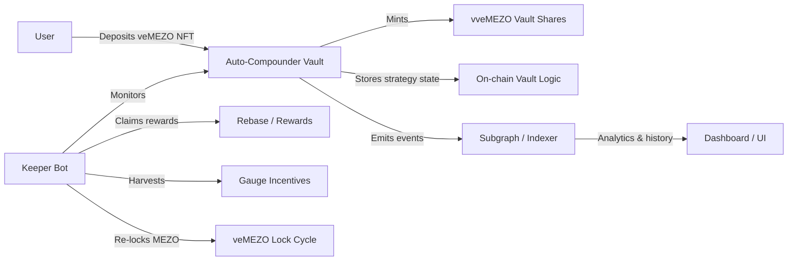
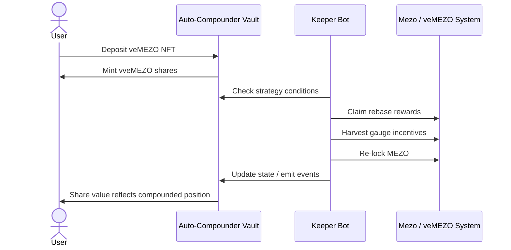
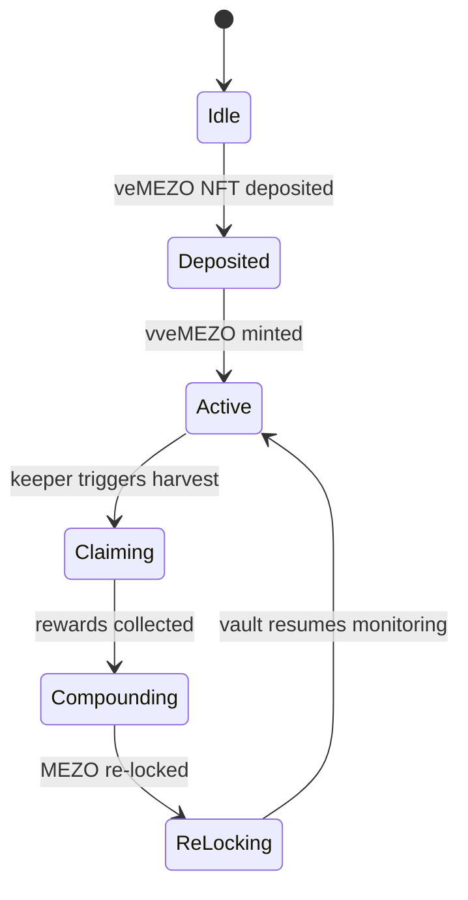
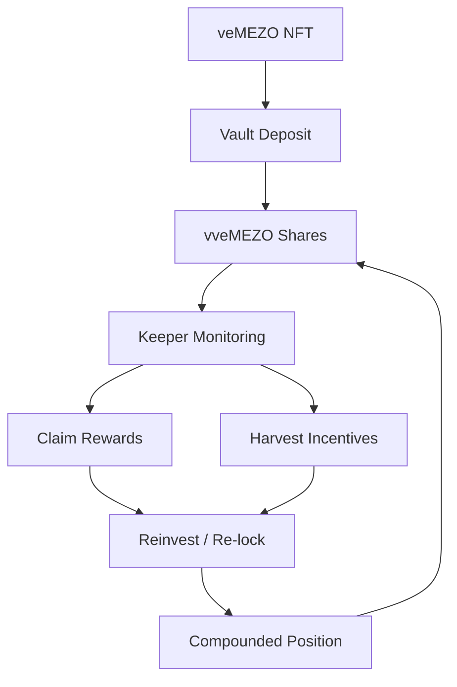

# The Auto-Compounder Vault

> **Non-custodial yield optimization for veMEZO positions on Mezo**
> Users deposit veMEZO NFTs, receive vault shares (`vveMEZO`), and a keeper bot automates reward claiming, gauge harvesting, and re-locking.

---

## Table of Contents

* [Overview](#overview)
* [Why This Exists](#why-this-exists)
* [Key Features](#key-features)
* [How It Works](#how-it-works)
* [Architecture](#architecture)
* [Technical Diagrams](#technical-diagrams)
* [Repository Structure](#repository-structure)
* [Core Components](#core-components)
* [Security Model](#security-model)
* [Development](#development)
* [Build & Verification](#build--verification)
* [Roadmap](#roadmap)
* [License](#license)

---

## Overview

**The Auto-Compounder Vault** is a non-custodial protocol that automates the management of **vote-escrowed MEZO (veMEZO)** positions on the Mezo network.

Instead of manually claiming rewards, harvesting incentives, and re-locking MEZO, users deposit their **veMEZO NFTs** into the vault. In return, they receive **vault shares (`vveMEZO`)** that represent their claim on the vault’s underlying position and performance.

The protocol is designed around a simple principle:

> **Lock once. Automate forever.**

---

## Why This Exists

Managing vote-escrowed positions can be repetitive and easy to get wrong:

* reward claims need to happen on time
* gauge incentives may be missed if no one acts
* re-locking can be forgotten
* manual execution creates overhead and operational risk

This vault removes that burden by automating the lifecycle of veMEZO management while keeping user ownership non-custodial.

---

## Key Features

* **Non-custodial deposits**

  * users keep economic ownership through vault shares
* **Vault share issuance**

  * deposited veMEZO positions are represented by `vveMEZO`
* **Automated compounding**

  * keeper bot claims rewards and reinvests them
* **Gauge incentive harvesting**

  * incentive flows are collected and recycled into the strategy
* **Re-lock automation**

  * MEZO is re-locked to preserve veMEZO exposure
* **On-chain transparency**

  * state changes are observable and auditable
* **Modular stack**

  * smart contracts, keeper automation, and subgraph indexing

---

## How It Works

1. **User deposits veMEZO NFT** into the vault.
2. **Vault mints `vveMEZO` shares** to represent the user’s position.
3. **Keeper bot monitors vault state** and triggers compounding actions.
4. **Rewards are claimed** from the veMEZO position.
5. **Gauge incentives are harvested** when available.
6. **MEZO is re-locked** to maintain the veMEZO strategy.
7. **Vault value grows** and share value tracks the optimized position.

---

## Architecture

The repository is organized around three cooperating layers:

* **Smart contracts** — vault logic, share accounting, and position control
* **Keeper service** — automated execution of compounding and maintenance actions
* **Subgraph / indexing layer** — events, state history, and analytics support

### High-level architecture



---

## Technical Diagrams

### 1) Protocol lifecycle



### 2) State transition model



### 3) Value flow



---

## Repository Structure

Based on the current repo layout, the project is split into:

```text
contracts/      Solidity contracts for vault logic and on-chain strategy
keeper/         Off-chain automation / keeper bot
subgraph/       Indexing and event-query layer
scripts/        Deployment, maintenance, and utility scripts
artifacts/      Build outputs and compiled artifacts
attached_assets/ Supporting files and design assets
```

Additional workspace files include TypeScript configuration, pnpm workspace configuration, and project metadata.

---

## Core Components

### Vault Contract

Responsibilities:

* accept veMEZO NFT deposits
* mint `vveMEZO` vault shares
* track position ownership and vault state
* expose accounting for deposits, redemptions, and compounding

### Keeper Bot

Responsibilities:

* monitor vault state
* decide when compounding actions should run
* claim rebase rewards
* harvest gauge incentives
* re-lock MEZO to maintain strategy continuity

### Subgraph

Responsibilities:

* index protocol events
* support analytics and historical views
* power dashboards or explorers
* simplify querying of vault state over time

---

## Security Model

This protocol is built around a non-custodial design, which means the strategy should prioritize user ownership, auditable state, and predictable execution.

### Security goals

* **No hidden custody assumptions**

  * vault accounting should remain transparent
* **Deterministic on-chain behavior**

  * critical state transitions belong on-chain
* **Minimal keeper trust**

  * the keeper triggers actions; it should not own user funds
* **Clear share accounting**

  * `vveMEZO` should map cleanly to vault ownership
* **Observable event history**

  * activity should be indexable and verifiable

### Threats to consider

* stale keeper execution
* reward timing mismatches
* share accounting drift
* NFT handling edge cases
* compounding failures due to external dependencies

---

## Development

This repository uses a **pnpm workspace** and TypeScript-focused tooling.

### Prerequisites

* Node.js
* pnpm

### Install

```bash
pnpm install
```

### Typecheck

```bash
pnpm run typecheck
```

### Build

```bash
pnpm run build
```

The root package script enforces pnpm usage and removes alternate lockfiles during install.

---

## Build & Verification

### Suggested workflow

1. install dependencies
2. run typechecks
3. compile Solidity contracts
4. validate keeper scripts
5. confirm subgraph indexing
6. review emitted events in a local test environment

### Example verification checklist

* contract compilation succeeds
* vault share mint/burn logic is consistent
* keeper actions can be simulated safely
* state transitions are emitted as events
* subgraph can query deposit and compounding history

---

## Roadmap

* [ ] finalize vault share accounting model
* [ ] add end-to-end deposit → compound → re-lock flow
* [ ] expand keeper automation safeguards
* [ ] add analytics dashboards for vault performance
* [ ] improve indexing for position history
* [ ] document deployment and operational runbooks

---

## FAQ

### What does the vault do?

It automates the management of veMEZO positions by handling reward claiming, gauge harvesting, and re-locking on behalf of the strategy.

### What do users receive after deposit?

Users receive **`vveMEZO` vault shares**, which represent their participation in the vault.

### Is the protocol custodial?

No. The design is intended to be **non-custodial**.

### What is the keeper bot?

The keeper bot is an off-chain automation service that watches protocol conditions and triggers maintenance actions when appropriate.

---

## License

MIT License.
